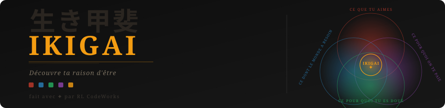

# Ikigai Interactif

Un outil web autonome pour explorer et formaliser son ikigai, propulsé par l'IA.


🔗 **[Accéder à l'outil en ligne](https://ikigai-rlcodeworks.netlify.app/)**

---

## À propos

L'**ikigai** (生き甲斐) est un concept japonais désignant la raison d'être — le point de convergence entre ce qu'on aime, ce dont le monde a besoin, ce pour quoi on est doué, et ce pour quoi on peut être rémunéré.

Cet outil guide l'utilisateur à travers les quatre dimensions, puis génère via l'API Claude une synthèse personnalisée : points clés, intersections, formulation de l'ikigai central, tensions identifiées et première action concrète.

---

## Fonctionnalités

- **Écran d'accueil** avec définition et personnalisation par prénom
- **4 onglets guidés** avec questions contextualisées et exemples cliquables (perso, pro, créatif, entrepreneurial)
- **Génération IA** via Claude Sonnet — synthèse structurée, intersections, ikigai formulé, tensions et prochaine action
- **Diagramme SVG** des 4 cercles avec centre ikigai, personnalisé au prénom
- **Export PDF** via impression navigateur
- **Aucune dépendance externe** — un seul fichier HTML autonome

---

## Démo rapide

```
1. Accéder à https://ikigai-rlcodeworks.netlify.app/
2. Saisir un prénom (facultatif)
3. Remplir les 4 onglets (Passion → Mission → Vocation → Profession)
4. Cliquer sur "Révéler mon Ikigai"
```

---

## Installation & déploiement

### Cloner le projet

```bash
git clone https://github.com/remy-llauberes/IKIGAI.git
cd IKIGAI
```

### Déployer sur Netlify

L'outil nécessite un proxy backend pour appeler l'API Anthropic (contrainte CORS). Le projet est préconfiguré pour Netlify :

1. Connecter le repo GitHub à [Netlify](https://app.netlify.com) → **Add new site** → **Import from Git**
2. Ajouter la variable d'environnement dans **Site configuration** → **Environment variables** :
   ```
   ANTHROPIC_API_KEY = sk-ant-xxxxxxxxxxxxxxxx
   ```
3. Déclencher un déploiement — Netlify détecte automatiquement `netlify.toml` et déploie la fonction proxy

> La clé API n'est jamais exposée côté navigateur — elle transite uniquement par la fonction serverless.

---

## Structure du projet

```
IKIGAI/
├── index.html                        # Application principale
├── netlify.toml                      # Configuration Netlify
├── netlify/
│   └── functions/
│       └── claude-proxy.js           # Proxy serverless vers l'API Anthropic
├── banner.svg                        # Bannière du README
└── README.md
```

---

## Personnalisation

| Élément | Où modifier |
|---|---|
| Couleurs des cercles | Variables CSS `:root` dans `index.html` |
| Questions des onglets | Balises `<label>` dans chaque `question-block` |
| Exemples cliquables | Balises `<span class="ex-tag">` |
| Modèle IA utilisé | Paramètre `model` dans `generateSynthesis()` |
| Prompt de synthèse | Variable `prompt` dans `generateSynthesis()` |
| Lien footer | Attribut `href` du lien RL CodeWorks dans `renderDiagram()` |

---

## Technologies

- **HTML/CSS/JS** vanilla — aucun framework
- **[Claude Sonnet 4](https://www.anthropic.com)** (Anthropic) — génération de la synthèse
- **Netlify Functions** — proxy serverless pour les appels API
- **Google Fonts** — Cinzel + Crimson Pro
- **SVG** natif — diagramme des 4 cercles

---

## Licence

MIT — libre d'utilisation, de modification et de redistribution, avec mention de l'auteur original.

---

## Auteur

Conçu par **[RL CodeWorks](https://rlcodeworks.fr)** — outils web créatifs & projets numériques.

> *"Trouve ce qui se trouve à l'intersection de ce que tu aimes, de ce en quoi tu es bon, de ce dont le monde a besoin et de ce pour quoi tu peux être payé."*
